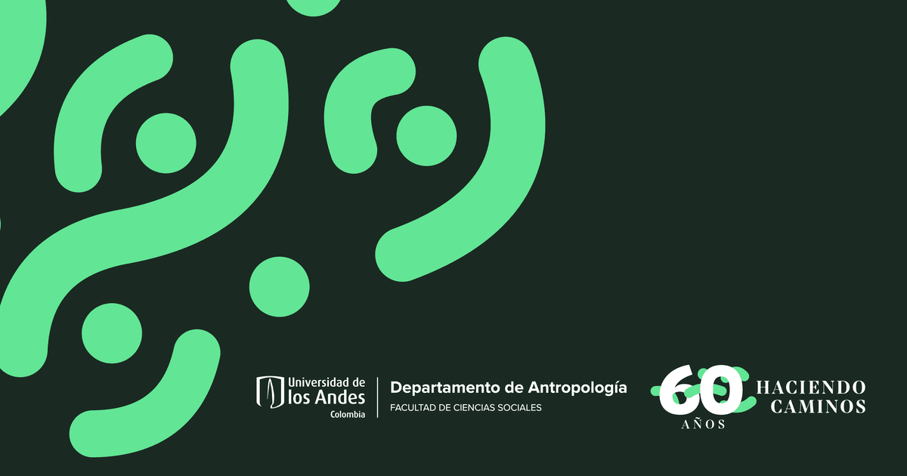

# Antropología Uniandes - 60 años haciendo caminos

Haciendo Caminos es la historia del Departamento de Antropología de la Universidad de Los Andes contada a través de los proyectos de investigación que sus profesores y estudiantes han realizado desde su creación.
